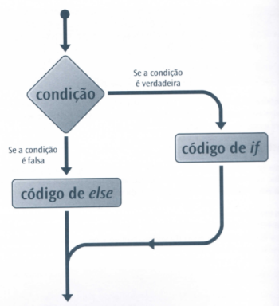

As instruções condicionais alteram o fluxo de controle de seu programa.

Elas dizem se devem ir para a "direita" ou para a "esquerda"

A instrução condicional mais comum é o `if`.

    if (expressão-condicional) {
        ... executar código
        ... executar código
        ... executar código
    }

Logo após a palavra `if` temos a expressão condicional entre parênteses `if (expressão-condicional) {`.

O bloco `if` só será executado se a expressão for verdadeira ou, em outras palavras, retornar `true`.

A imagem abaixo, um diagrama de bloco, ilustra o fluxo:

O bloco `else` só será executado se a expressão retornar `false`.

    if (expressão-condicional) {
        ... executar código
        ... executar código
        ... executar código
    } else {
        ... executar código
        ... executar código
        ... executar código
    }

Veja imagem abaixo:

Diagrama de sintaxe
---

A ilustração abaixo é genial, trata-se de um diagrama de sintaxe elabora pelo mago do JS (Douglas Crockford).

Ela demonstra a instrução __if-else no JavaScript__.

A primeira vez que eu vi esse diagrama achei meio confuso, logo pensei: "mais um diagrama", depois que eu o compreendi,
achei genial.

Repare que você pode seguir a linha o diagrama e dependendo de onde entrar só poderá segui em frente.

